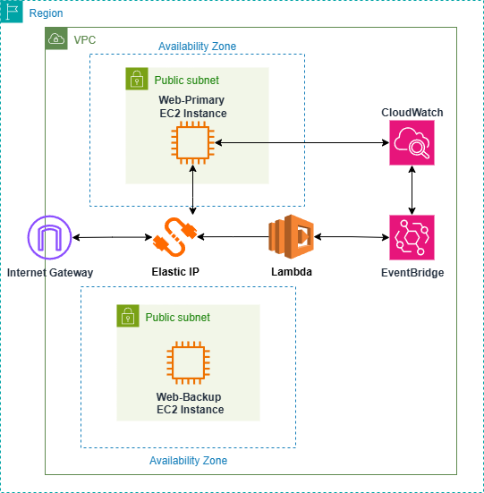

#### Overview of the Lab: Software-Defined Networking with AWS

This lab guides you through implementing fundamental Software-Defined Networking (SDN) concepts within an Amazon Web Services (AWS) environment. You will gain practical experience with programmatic network control, dynamic routing, and policy automation. The core of this project is to build a robust, automated failover mechanism for web servers using AWS services. By the end of this lab, you will understand how a centralized control plane (AWS Lambda, CloudWatch) can dynamically manage a distributed data plane (EC2, VPC, EIP) to ensure high availability and network resilience.

#### Architecture Diagram

The diagram above illustrates the architecture we will implement:

1.  **Data Plane (VPC, Subnets, EC2 Instances):** The foundational network infrastructure where all your resources reside. It includes two EC2 instances (`Web-Primary` and `Web-Backup`) in separate public subnets for high availability.
2.  **Internet Gateway & Elastic IP:** The `Internet Gateway` provides internet connectivity to your VPC, while a single `Elastic IP` acts as a static, public access point for your web service.
3.  **Control Plane (CloudWatch, EventBridge, Lambda):** This is the automated brain of the SDN solution.
    * **CloudWatch Alarm** actively monitors the health of the `Web-Primary` instance.
    * **EventBridge Rule** listens for an `ALARM` state change from CloudWatch.
    * **Lambda Function** is triggered by EventBridge and executes a pre-defined policy: re-associating the `Elastic IP` from the failed `Web-Primary` to the healthy `Web-Backup`.

#### Lab Breakdown: What You Will Do?

* **Part 2: Preparation:** Set up the foundational AWS network infrastructure and IAM permissions.
* **Part 3: Deploy Web Servers:** Launch the primary and backup EC2 instances and configure an Elastic IP.
* **Part 4: Create and configure Lambda Function:** Build the serverless control plane logic for failover.
* **Part 5: Create Monitoring and Trigger:** Establish the event-driven mechanism using CloudWatch and EventBridge.
* **Part 6: Verify Dynamic Routing:** Test the automated failover process by simulating a primary server failure.
* **Part 7: Clean up Resources:** Systematically remove all created AWS resources to avoid future costs.

#### Contents:

* [Part 2: Preparation](/2-Preparation/_index.md)
* [Part 3: Deploy Web Servers](/3-Deploy-Web-Servers/_index.md)
* [Part 4: Create and configure Lambda Function](/4-Create-and-configure-Lambda-Function/_index.md)
* [Part 5: Create Monitoring and Trigger](/5-Create-Monitoring-and-Trigger/_index.md)
* [Part 6: Verify Dynamic Routing](/6-Verify-Dynamic-Routing-and-Policy-Automation/_index.md)
* [Part 7: Clean up Resources](/7-Clean-up-Resources/_index.md)