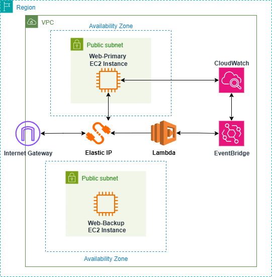

#### Tổng quan về bài lab: Software-Defined Networking với AWS

Bài lab này sẽ hướng dẫn bạn triển khai các khái niệm nền tảng của Software-Defined Networking (SDN) trong môi trường Amazon Web Services (AWS). Bạn sẽ có kinh nghiệm thực tế với việc điều khiển mạng bằng lập trình, định tuyến động và tự động hóa chính sách. Cốt lõi của dự án này là xây dựng một cơ chế failover tự động và mạnh mẽ cho các máy chủ web bằng cách sử dụng các dịch vụ của AWS. Cuối cùng, bạn sẽ hiểu cách một mặt phẳng điều khiển tập trung (AWS Lambda, CloudWatch) có thể quản lý động một mặt phẳng dữ liệu phân tán (EC2, VPC, EIP) để đảm bảo tính sẵn sàng cao và khả năng phục hồi của mạng.

#### Sơ đồ Kiến trúc

Sơ đồ trên minh họa kiến trúc chúng ta sẽ triển khai:

1.  **Mặt phẳng dữ liệu (VPC, Subnets, EC2 Instances):** Cơ sở hạ tầng mạng nền tảng nơi tất cả các tài nguyên của bạn cư trú. Nó bao gồm hai EC2 Instance (`Web-Primary` và `Web-Backup`) trong các public subnet riêng biệt để đảm bảo tính sẵn sàng cao.
2.  **Internet Gateway & Elastic IP:** `Internet Gateway` cung cấp kết nối Internet cho VPC, trong khi một `Elastic IP` duy nhất hoạt động như một điểm truy cập công cộng, tĩnh cho dịch vụ web của bạn.
3.  **Mặt phẳng điều khiển (CloudWatch, EventBridge, Lambda):** Đây là bộ não tự động của giải pháp SDN.
    * **CloudWatch Alarm** chủ động giám sát tình trạng sức khỏe của `Web-Primary` instance.
    * **EventBridge Rule** lắng nghe sự thay đổi trạng thái `ALARM` từ CloudWatch.
    * **Lambda Function** được kích hoạt bởi EventBridge và thực thi một chính sách được xác định trước: liên kết lại `Elastic IP` từ `Web-Primary` bị lỗi sang `Web-Backup` khỏe mạnh.

#### Phân tích Bài Lab: Bạn sẽ làm gì?

* **Phần 2: Chuẩn bị:** Thiết lập cơ sở hạ tầng mạng AWS nền tảng và quyền IAM.
* **Phần 3: Triển khai Web Servers:** Khởi chạy các EC2 instance chính và dự phòng, và cấu hình một Elastic IP.
* **Phần 4: Tạo và cấu hình Lambda Function:** Xây dựng logic mặt phẳng điều khiển serverless cho failover.
* **Phần 5: Tạo Giám sát và Kích hoạt:** Thiết lập cơ chế hướng sự kiện bằng cách sử dụng CloudWatch và EventBridge.
* **Phần 6: Xác minh Định tuyến động:** Kiểm tra quá trình failover tự động bằng cách mô phỏng lỗi máy chủ chính.
* **Phần 7: Dọn dẹp tài nguyên:** Xóa một cách có hệ thống tất cả các tài nguyên AWS đã tạo để tránh chi phí trong tương lai.

#### Nội dung:

* [Phần 2: Chuẩn bị](/2-Preparation/_index.md)
* [Phần 3: Triển khai Web Servers](/3-Deploy-Web-Servers/_index.md)
* [Phần 4: Tạo và cấu hình Lambda Function](/4-Create-and-configure-Lambda-Function/_index.md)
* [Phần 5: Tạo Giám sát và Kích hoạt](/5-Create-Monitoring-and-Trigger/_index.md)
* [Phần 6: Xác minh Định tuyến động](/6-Verify-Dynamic-Routing-and-Policy-Automation/_index.md)
* [Phần 7: Dọn dẹp tài nguyên](/7-Clean-up-Resources/_index.md)