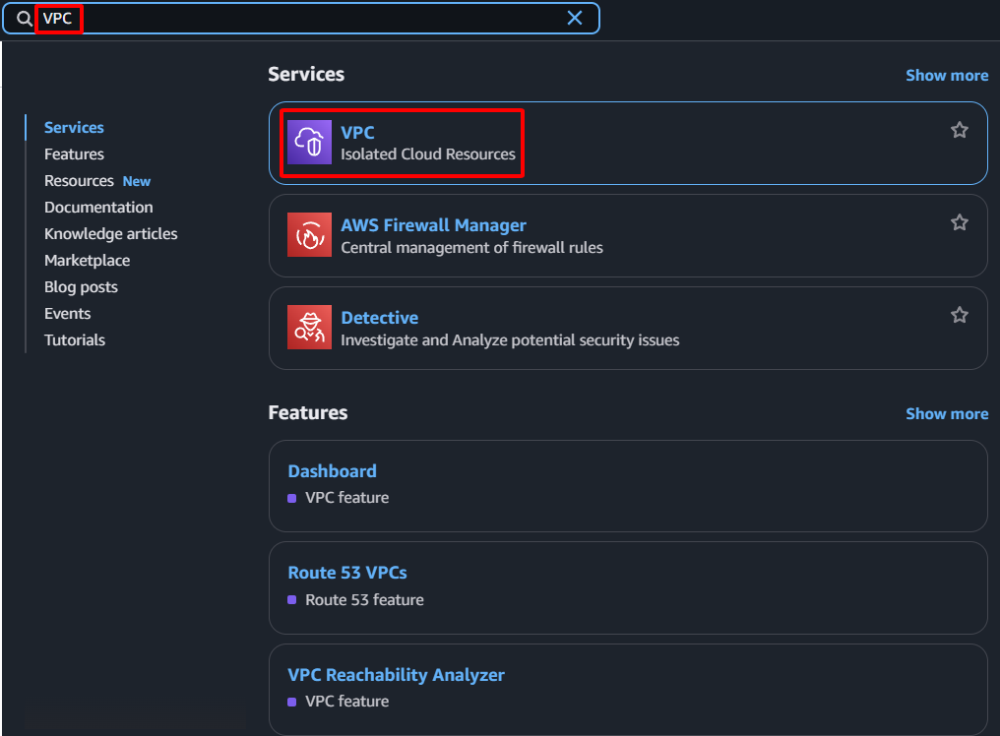

**Objective:** To establish an isolated and secure virtual network environment within AWS, which will house all project resources.
#### Execution Steps

1. **Access AWS Management Console:** Log in to your AWS account.
2. **Navigate to the VPC service:** In the search bar, type "VPC" and select the VPC service.

    
    
3. **Initiate VPC creation:**
    - Select **Your VPCs** from the left navigation pane.
    - Click the **Create VPC** button.
    
    
    
4. **Configure VPC parameters:**
    - **Name tag:** Type `sdn-project-vpc`
    - **IPv4 CIDR block:** Type `10.0.0.0/16`
    - **Tenancy:** Maintain the default setting of `Default`.
    
    
    
5. **Complete VPC creation:** Click the **Create VPC** button.
    
    
    
6. **Confirm and record:** A success message confirming VPC creation will be displayed. Record the **VPC ID** for subsequent configurations.
    
    