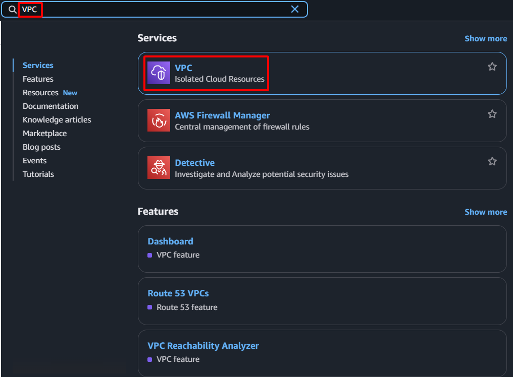

**Mục tiêu:** Thiết lập một môi trường mạng ảo cô lập và bảo mật trong AWS, nơi sẽ chứa tất cả các tài nguyên của dự án.
#### Các bước thực hiện

1.  **Truy cập AWS Management Console:** Đăng nhập vào tài khoản AWS của bạn.
2.  **Điều hướng đến dịch vụ VPC:** Trong thanh tìm kiếm, gõ "VPC" và chọn dịch vụ VPC.

    

3.  **Bắt đầu tạo VPC:**
    * Chọn **Your VPCs** từ bảng điều hướng bên trái.
    * Nhấn vào nút **Create VPC**.

    

4.  **Cấu hình các tham số VPC:**
    * **Name tag:** Nhập `sdn-project-vpc`
    * **IPv4 CIDR block:** Nhập `10.0.0.0/16`
    * **Tenancy:** Giữ cài đặt mặc định là `Default`.

    

5.  **Hoàn tất việc tạo VPC:** Nhấn nút **Create VPC**.

    

6.  **Xác nhận và ghi lại:** Một thông báo thành công xác nhận VPC đã được tạo sẽ hiển thị. Ghi lại **VPC ID** để cấu hình cho các bước tiếp theo.

    