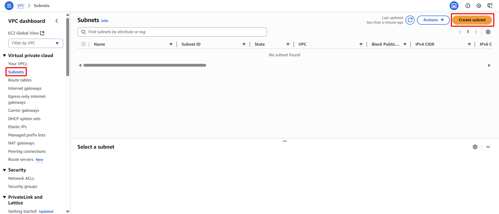

**Objective:** To partition the VPC's IP address space into smaller segments (Subnets) for organized resource placement and enhanced traffic control. Two public Subnets will be created in distinct Availability Zones (AZs) to improve high availability.
#### Execution Steps
1. **Navigate to Subnets:** From the VPC Dashboard, select **Subnets** in the left navigation pane.
2. **Initiate Subnet creation:** Click the **Create subnet** button.
    
    
    
3. **Configure the first Subnet (Public Subnet 1):**
    - **VPC ID:** Select `sdn-project-vpc`
        
        
        
    - **Subnet name:** Type `sdn-public-subnet-1a`
    - **Availability Zone:** Select `us-east-1a`
    - **IPv4 CIDR block:** Type `10.0.1.0/24`
    
    
    
4. **Complete Subnet 1 creation:** Click the **Create subnet** button.
    
    
    
5. **Configure the second Subnet (Public Subnet 2):** Repeat steps 3 and 4 for a second Subnet:
    - **VPC ID:** Select `sdn-project-vpc`
        
        
        
    - **Subnet name:** Type `sdn-public-subnet-1b`
    - **Availability Zone:** Select  `us-east-1b`
    - **IPv4 CIDR block:** Type `10.0.2.0/24`
    
    
    
6. **Complete Subnet 2 creation:** Click the **Create subnet** button.
    
    
    
7. **Enable automatic public IP assignment for Public Subnets:**
    - Select `sdn-public-subnet-1a`.
    - Choose **Actions** -> **Modify auto-assign IP settings**.
        
        
        
    - Select the **Enable auto-assign public IPv4 address** checkbox.
    - Click **Save**.
        
        
        
        
        
    - Perform the same steps for `sdn-public-subnet-1b`
        
        
        
        
        
        
        
8. **Confirm and record:** The two new Subnets will appear in the list. Record the **Subnet IDs** for both Subnets.