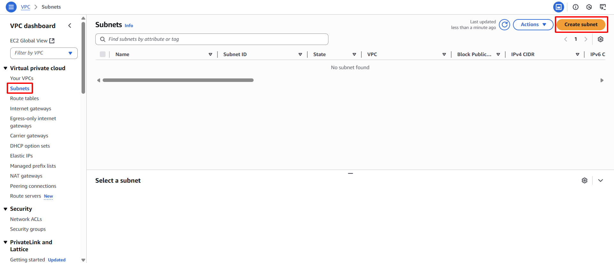

**Mục tiêu:** Phân chia không gian địa chỉ IP của VPC thành các phân đoạn nhỏ hơn (Subnet) để sắp xếp tài nguyên và tăng cường kiểm soát lưu lượng. Hai Subnet công cộng sẽ được tạo trong các Availability Zone (AZ) riêng biệt để cải thiện tính sẵn sàng cao.
#### Các bước thực hiện
1. **Điều hướng đến Subnets:** Từ VPC Dashboard, chọn **Subnets** trong bảng điều hướng bên trái.
2. **Bắt đầu tạo Subnet:** Nhấn nút **Create subnet**.

    

3. **Cấu hình Subnet đầu tiên (Public Subnet 1):**
    - **VPC ID:** Chọn `sdn-project-vpc`

    

    - **Subnet name:** Nhập `sdn-public-subnet-1a`
    - **Availability Zone:** Chọn `us-east-1a`
    - **IPv4 CIDR block:** Nhập `10.0.1.0/24`

    

4. **Hoàn tất tạo Subnet 1:** Nhấn nút **Create subnet**.

    

5. **Cấu hình Subnet thứ hai (Public Subnet 2):** Lặp lại các bước 3 và 4 cho một Subnet thứ hai:
    - **VPC ID:** Chọn `sdn-project-vpc`

    

    - **Subnet name:** Nhập `sdn-public-subnet-1b`
    - **Availability Zone:** Chọn `us-east-1b`
    - **IPv4 CIDR block:** Nhập `10.0.2.0/24`

    

6. **Hoàn tất tạo Subnet 2:** Nhấn nút **Create subnet**.

    

7. **Bật tự động gán IP công cộng cho các Public Subnet:**
    - Chọn `sdn-public-subnet-1a`.
    - Chọn **Actions** -> **Modify auto-assign IP settings**.

    

    - Chọn hộp kiểm **Enable auto-assign public IPv4 address**.
    - Nhấn **Save**.

    

    

    - Thực hiện các bước tương tự cho `sdn-public-subnet-1b`

    

    

    

8. **Xác nhận và ghi lại:** Hai Subnet mới sẽ xuất hiện trong danh sách. Ghi lại **Subnet IDs** của cả hai Subnet.