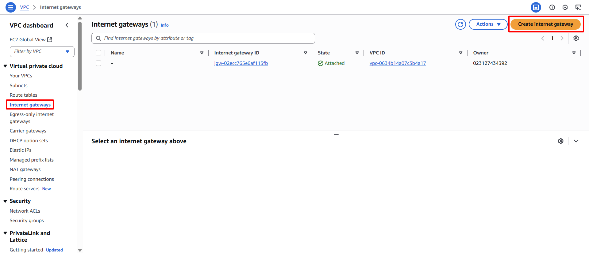

**Objective:** To enable resources within the Public Subnet of your VPC to communicate with the Internet.
#### Execution Steps
1. **Access Internet Gateways:** In the VPC Dashboard, select **Internet Gateways** from the left navigation pane.
2. **Initiate Internet Gateway creation:** Click the **Create internet gateway** button.
    
    
    
3. **Configure Internet Gateway:**
    - **Name tag:** Type `sdn-project-igw`
4. **Complete Internet Gateway creation:** Click the **Create internet gateway** button.
    
    
    
5. **Attach Internet Gateway to VPC:**
    - Once the IGW is created (it will be in a `Detached` state), select the newly created IGW.
    - Choose **Actions** -> **Attach to VPC**.
        
        
        
    - Select `sdn-project-vpc` from the dropdown list.
    - Click the **Attach internet gateway** button.
        
        
        
6. **Confirm attachment:** The **State** of the Internet Gateway will transition to `Attached`.
    
    