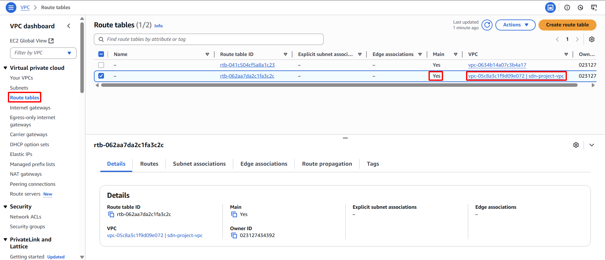

**Objective:** To define how network packets are routed within and outside your Subnets. A Route Table will be configured to direct Internet-bound traffic through the Internet Gateway.
#### Execution Steps
1. **Access Route Tables:** In the VPC Dashboard, select **Route Tables** from the left navigation pane.
2. **Identify the target Route Table:** A default Route Table is automatically generated and associated with the VPC upon creation. This Route Table will be utilized. Locate the Route Table with a **VPC ID** matching `sdn-project-vpc` and a **Main** column value of `Yes`.
    
    
    
3. **Add default Internet route:**
    - Select the identified Route Table.
    - Choose the **Routes** tab.
    - Click the **Edit routes** button.
        
        
        
    - Click **Add route**.
    - **Destination:** Enter `0.0.0.0/0` (representing all IPv4 Internet traffic).
    - **Target:** Select **Internet Gateway** from the dropdown, then choose `sdn-project-igw` (your created IGW).
    - Click the **Save changes** button.
        
        
        
4. **Associate Subnets with the Route Table:**
    - Select the **Subnet associations** tab.
    - Click the **Edit subnet associations** button.
        
        
        
    - Select both Subnets: `sdn-public-subnet-1a` and `sdn-public-subnet-1b`.
    - Click the **Save associations** button.
        
        
        
5. **Confirm association:** Verify that both public Subnets are now associated with the Route Table configured for Internet access.
    
    