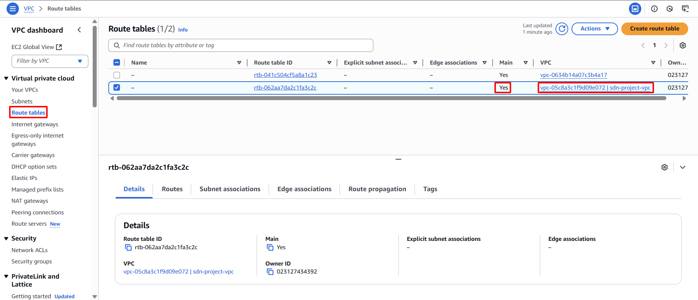

**Mục tiêu:** Định nghĩa cách các gói mạng được định tuyến trong và ngoài Subnet của bạn. Một Route Table sẽ được cấu hình để định tuyến lưu lượng truy cập Internet thông qua Internet Gateway.
#### Các bước thực hiện
1. **Truy cập Route Tables:** Trong VPC Dashboard, chọn **Route Tables** từ bảng điều hướng bên trái.
2. **Xác định Route Table đích:** Một Route Table mặc định được tự động tạo và liên kết với VPC khi khởi tạo. Route Table này sẽ được sử dụng. Định vị Route Table có **VPC ID** khớp với `sdn-project-vpc` và giá trị cột **Main** là `Yes`.
    
    
    
3. **Thêm tuyến đường Internet mặc định:**
    - Chọn Route Table đã xác định.
    - Chọn tab **Routes**.
    - Nhấn nút **Edit routes**.
        
        
        
    - Nhấn **Add route**.
    - **Destination:** Nhập `0.0.0.0/0` (đại diện cho tất cả lưu lượng truy cập Internet IPv4).
    - **Target:** Chọn **Internet Gateway** từ danh sách thả xuống, sau đó chọn `sdn-project-igw` (IGW đã tạo của bạn).
    - Nhấn nút **Save changes**.
        
        
        
4. **Liên kết Subnet với Route Table:**
    - Chọn tab **Subnet associations**.
    - Nhấn nút **Edit subnet associations**.
        
        
        
    - Chọn cả hai Subnet: `sdn-public-subnet-1a` và `sdn-public-subnet-1b`.
    - Nhấn nút **Save associations**.
        
        
        
5. **Xác nhận liên kết:** Xác minh rằng cả hai Public Subnet hiện đã được liên kết với Route Table được cấu hình cho truy cập Internet.
    
    