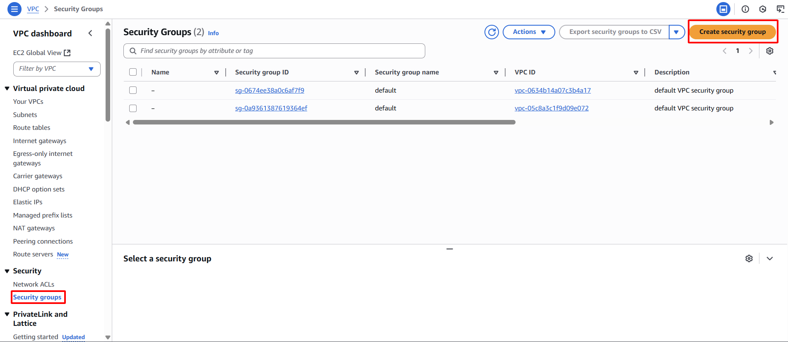

**Objective:** To deploy a Security Group that governs inbound and outbound network traffic for your EC2 Instances (web servers), permitting only essential communication ports (HTTP, HTTPS, SSH).
#### Execution Steps
1. **Navigate to Security Groups:**
    - Within the AWS Management Console, access the EC2 service.
    - In the left navigation pane, under "Network & Security", select **Security Groups**.
2. **Initiate Security Group creation:** Click the **Create security group** button.
    
    
    
3. **Configure basic information:**
    - **Security group name:** `web-server-sg`
    - **Description:**  `Allows HTTP/HTTPS and SSH traffic to web servers`
    - **VPC:** Select `sdn-project-vpc`
    
    
    
4. **Configure Inbound rules (Incoming Traffic):**
    - Click **Add rule**.
        - **Type:** `HTTP` (Port: `80`)
        - **Source:** `Anywhere-IPv4` (`0.0.0.0/0`)
        
        
        
    - Click **Add rule**.
        - **Type:** `HTTPS` (Port: `443`)
        - **Source:** `Anywhere-IPv4` (`0.0.0.0/0`).
        
        
        
    - Click **Add rule**.
        - **Type:** `SSH` (Port: `22`)
        - **Source:** Select `My IP` to automatically populate your current public IP address. Opening SSH access from `0.0.0.0/0` is not recommended from a security perspective.
        
        
        
5. **Configure Outbound rules (Outgoing Traffic):** Retain the default setting of `All traffic` to `0.0.0.0/0`; this is sufficient for the scope of this lab.
6. **Complete Security Group creation:** Click the **Create security group** button.
    
    
    
7. **Confirm:** The new `web-server-sg` Security Group will appear in the list.
    
    