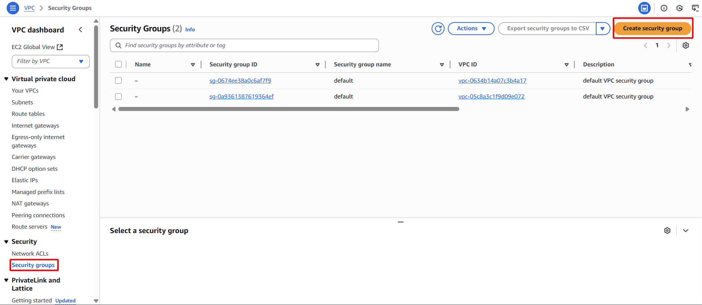

**Mục tiêu:** Triển khai một Security Group nhằm kiểm soát lưu lượng mạng vào và ra khỏi các EC2 Instance (máy chủ web), chỉ cho phép các cổng giao tiếp cần thiết (HTTP, HTTPS, SSH).
#### Các bước thực hiện
1. **Điều hướng đến Security Groups:**
    - Trong AWS Management Console, truy cập dịch vụ EC2.
    - Trong bảng điều hướng bên trái, dưới mục "Network & Security", chọn **Security Groups**.
2. **Khởi tạo Security Group:** Nhấn nút **Create security group**.
    
    
    
3. **Cấu hình thông tin cơ bản:**
    - **Security group name:** `web-server-sg`
    - **Description:** `Cho phép lưu lượng HTTP/HTTPS và SSH đến các máy chủ web`
    - **VPC:** Chọn `sdn-project-vpc`
    
    
    
4. **Cấu hình Inbound rules (Lưu lượng vào):**
    - Nhấn **Add rule**.
        - **Type:** `HTTP` (Cổng: `80`)
        - **Source:** `Anywhere-IPv4` (`0.0.0.0/0`)
        
        
        
    - Nhấn **Add rule**.
        - **Type:** `HTTPS` (Cổng: `443`)
        - **Source:** `Anywhere-IPv4` (`0.0.0.0/0`).
        
        
        
    - Nhấn **Add rule**.
        - **Type:** `SSH` (Cổng: `22`)
        - **Source:** Chọn `My IP` để tự động điền địa chỉ IP công cộng hiện tại của bạn. Việc mở quyền truy cập SSH từ `0.0.0.0/0` không được khuyến nghị từ góc độ bảo mật.
        
        
        
5. **Cấu hình Outbound rules (Lưu lượng ra):** Giữ cài đặt mặc định là `All traffic` đến `0.0.0.0/0`; điều này là đủ cho phạm vi của bài lab này.
6. **Hoàn tất tạo Security Group:** Nhấn nút **Create security group**.
    
    
    
7. **Xác nhận:** Security Group `web-server-sg` mới sẽ xuất hiện trong danh sách.
    
    