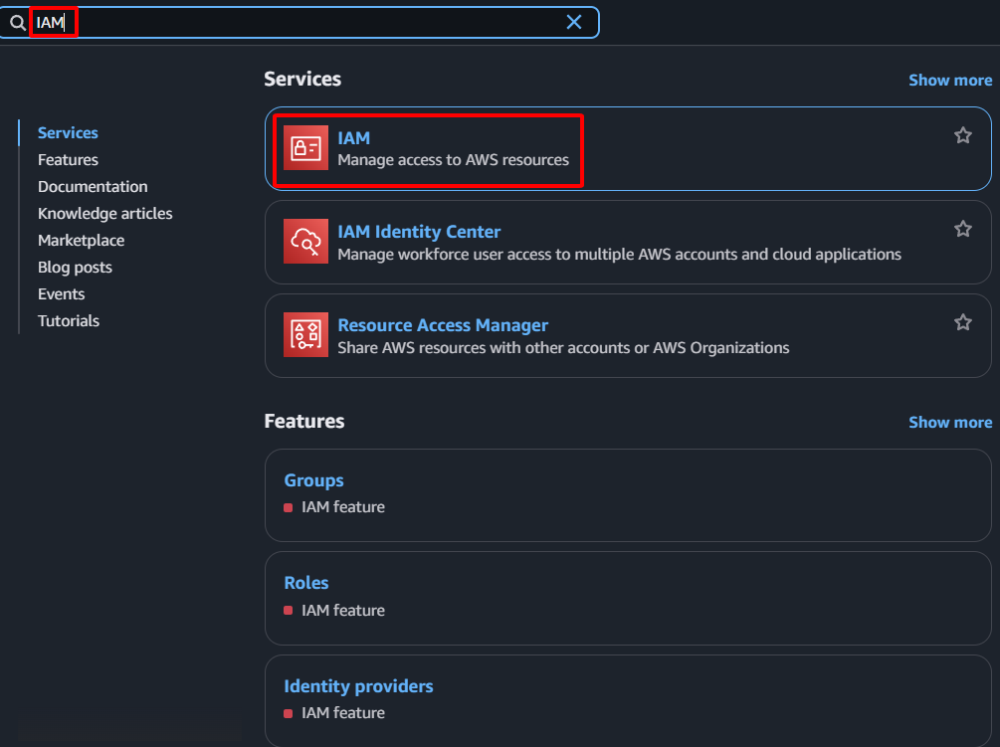

**Objective:** To define and assign the necessary permissions for AWS Lambda (our control plane) to execute actions such as reading EC2 Instance information, managing Elastic IPs (associating/disassociating), and writing logs to CloudWatch Logs.
#### Execution Steps
1. **Navigate to the IAM service:** In the AWS Console search bar, type "IAM" and select the IAM service.
    
    
    
2. **Create IAM Policy (Permissions Policy):**
    - In the left navigation pane, select **Policies**.
    - Click the **Create policy** button.
        
        
        
    - Select the **JSON** tab.
    - Remove the default content and paste the following JSON policy:
        
        ```json
        {
            "Version": "2012-10-17",
            "Statement": [
                {
                    "Effect": "Allow",
                    "Action": [
                        "ec2:DescribeInstances",
                        "ec2:AssociateAddress",
                        "ec2:DisassociateAddress",
                        "ec2:DescribeAddresses"
                    ],
                    "Resource": "*"
                },
                {
                    "Effect": "Allow",
                    "Action": [
                        "logs:CreateLogGroup",
                        "logs:CreateLogStream",
                        "logs:PutLogEvents"
                    ],
                    "Resource": "arn:aws:logs:*:*:*"
                }
            ]
        }
        ```
        
    
    
    
    - Click **Next**
    
    
    
    - **Name:** `SDNLambdaEIPControlPolicy`
    - **Description:** `Allows Lambda to control EC2 EIP associations and write logs.`
    
    
    
    - Click the **Create policy** button.
    
    
    
3. **Create IAM Role:**
    - In the left navigation pane, select **Roles**.
    - Click the **Create role** button.
    
    
    
    - **Select trusted entity:** Choose **AWS service**.
    - **Use case:** Select **Lambda**.
    - Click **Next**.
    
    
    
    - **Add permissions:** In the search field, type the name of the Policy just created (`SDNLambdaEIPControlPolicy`) and select it.
    - Click **Next**.
    
    
    
    - **Name, review, and create:**
        - **Role name:** `SDNLambdaRole`
        - **Description:** `Role for Lambda function to manage EIP for SDN failover.`
        
        
        
    - Click the **Create role** button.
    
    
    
4. **Confirm:** The new Policy and Role will appear in their respective lists.