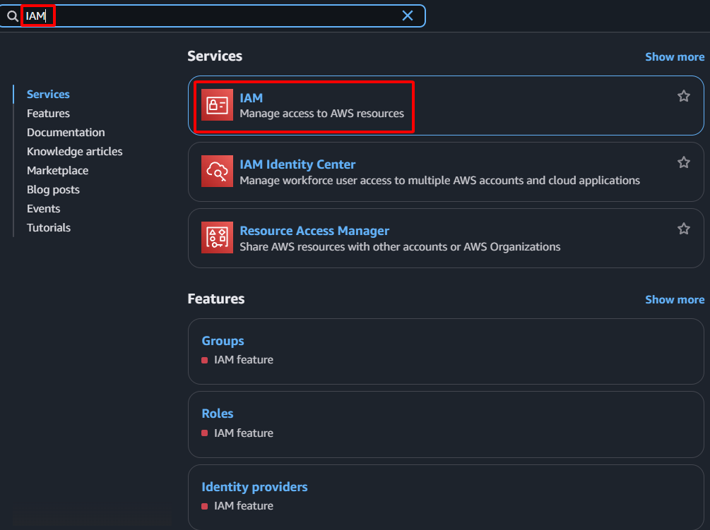

**Mục tiêu:** Định nghĩa và gán các quyền cần thiết cho AWS Lambda (mặt phẳng điều khiển của chúng ta) để thực hiện các hành động như đọc thông tin EC2 Instance, quản lý Elastic IP (liên kết/hủy liên kết), và ghi nhật ký vào CloudWatch Logs.
#### Các bước thực hiện
1. **Điều hướng đến dịch vụ IAM:** Trong thanh tìm kiếm của AWS Console, gõ "IAM" và chọn dịch vụ IAM.
    
    
    
2. **Tạo IAM Policy (Chính sách quyền hạn):**
    - Trong bảng điều hướng bên trái, chọn **Policies**.
    - Nhấn nút **Create policy**.
        
        
        
    - Chọn tab **JSON**.
    - Xóa nội dung mặc định và dán đoạn JSON policy sau:
        
        ```json
        {
            "Version": "2012-10-17",
            "Statement": [
                {
                    "Effect": "Allow",
                    "Action": [
                        "ec2:DescribeInstances",
                        "ec2:AssociateAddress",
                        "ec2:DisassociateAddress",
                        "ec2:DescribeAddresses"
                    ],
                    "Resource": "*"
                },
                {
                    "Effect": "Allow",
                    "Action": [
                        "logs:CreateLogGroup",
                        "logs:CreateLogStream",
                        "logs:PutLogEvents"
                    ],
                    "Resource": "arn:aws:logs:*:*:*"
                }
            ]
        }
        ```
        
    
    
    
    - Nhấn **Next**
    
    
    
    - **Name:** `SDNLambdaEIPControlPolicy`
    - **Description:** `Allows Lambda to control EC2 EIP associations and write logs.`
    
    
    
    - Nhấn nút **Create policy**.
    
    
    
3. **Tạo IAM Role:**
    - Trong bảng điều hướng bên trái, chọn **Roles**.
    - Nhấn nút **Create role**.
    
    
    
    - **Select trusted entity:** Chọn **AWS service**.
    - **Use case:** Chọn **Lambda**.
    - Nhấn **Next**.
    
    
    
    - **Add permissions:** Trong trường tìm kiếm, gõ tên Policy vừa tạo (`SDNLambdaEIPControlPolicy`) và chọn nó.
    - Nhấn **Next**.
    
    
    
    - **Name, review, and create:**
        - **Role name:** `SDNLambdaRole`
        - **Description:** `Role for Lambda function to manage EIP for SDN failover.`
        
        
        
    - Nhấn nút **Create role**.
    
    
    
4. **Xác nhận:** Policy và Role mới sẽ xuất hiện trong danh sách tương ứng.