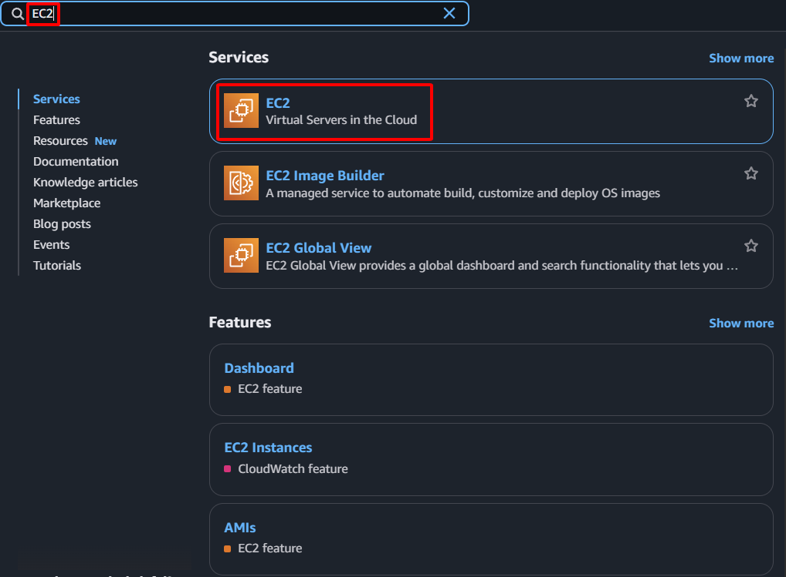

**Mục tiêu:** Triển khai EC2 Instance sẽ ban đầu đóng vai trò là máy chủ web chính.
#### Các bước thực hiện
1. **Truy cập EC2 Dashboard:** Điều hướng đến dịch vụ EC2 trong AWS Management Console.

    

2. **Bắt đầu khởi chạy Instance:** Chọn **Instances** từ bảng điều hướng bên trái, sau đó nhấn **Launch instances**.

    

3. **Tên và thẻ (tags):**
    - **Name:** `Web-Primary`
4. **Chọn Amazon Machine Image (AMI):** Chọn "Amazon Linux 2023 AMI"

    

5. **Chọn Instance Type:** Chọn `t2.micro` hoặc `t3.micro` (đủ điều kiện cho AWS Free Tier).

    

6. **Tạo Key Pair**
    - Nhấn **Create new key pair**
    - **Key pair name**: `sdn-key`
    - **Key pair type**: Chọn **RSA**
    - **Private key file format:** Chọn **.pem**
    - Nhấn **Create key pair**

    

    - **Quan trọng**: Tệp này chỉ được tải xuống một lần. Hãy lưu trữ nó ở nơi an toàn.
7. **Cấu hình chi tiết Instance:**
    - **Network:** Chọn `sdn-project-vpc`
    - **Subnet:** Chọn `sdn-public-subnet-1a`
    - **Auto-assign Public IP:** Đảm bảo `Enable` được chọn.
8. **Cấu hình Security Group:**
    - Chọn một Security Group hiện có.
    - Chọn `web-server-sg` đã tạo trước đó.

    

9. **Cấu hình User Data**
    - Mở rộng **Advanced Details** và tìm mục **User data**.

    

    - Dán script sau để cài đặt Nginx cho một máy chủ web đơn giản:

        ```bash
        #!/bin/bash
        sudo dnf update -y
        sudo dnf install nginx -y
        sudo systemctl start nginx
        sudo systemctl enable nginx
        echo "<h1>Hello from Web-Primary!</h1>" | sudo tee /usr/share/nginx/html/index.html
        ```

    

10. **Khởi chạy Instance:** Nhấn **Launch instance**.

    

11. **Xác nhận và ghi lại:** Ghi lại **Instance ID** của `Web-Primary` instance sau khi khởi chạy thành công.

    

    