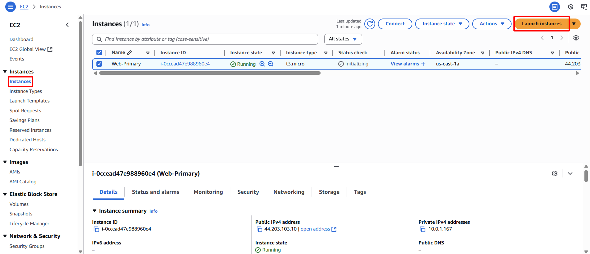

**Objective:** To deploy the EC2 instance that will serve as the backup web service, ready for failover.
#### Execution Steps
1. **Access EC2 Dashboard:** Navigate to the EC2 service.
2. **Initiate instance launch:** Select **Instances**, then click **Launch instances**.
    
    
    
3. **Name and tags**
    - **Name:** `Web-Backup`
4. **Choose Amazon Machine Image (AMI):** Select the same AMI as used for the primary instance.
    
    
    
5. **Select Instance Type:** Choose `t2.micro` or `t3.micro`
6. **Select Key Pair:** Choose the same key pair as used for the primary instance.
    
    
    
7. **Configure Instance Details:**
    - **Network:** Select `sdn-project-vpc`.
    - **Subnet:** Select `sdn-public-subnet-1b` (deploying in a different AZ enhances resilience).
    - **Auto-assign Public IP:** Ensure `Enable` is selected.
8. **Configure Security Group:**
    - Select an existing security group.
    - Choose the `web-server-sg`.
    
    
    
9. **Configure User Data**
    - Expand **Advanced Details** and locate **User data**.
    
    
    
    - Paste the following script:
        
        ```bash
        #!/bin/bash
        sudo dnf update -y
        sudo dnf install nginx -y
        sudo systemctl start nginx
        sudo systemctl enable nginx
        echo "<h1>Hello from Web-Backup!</h1>" | sudo tee /usr/share/nginx/html/index.html
        ```
        
    
    
    
10. **Launch Instance:** Click **Launch instance**.
    
    
    
11. **Confirm and record:** Record the **Instance ID** of the `Web-Backup` instance upon successful launch.
    
    
    
    