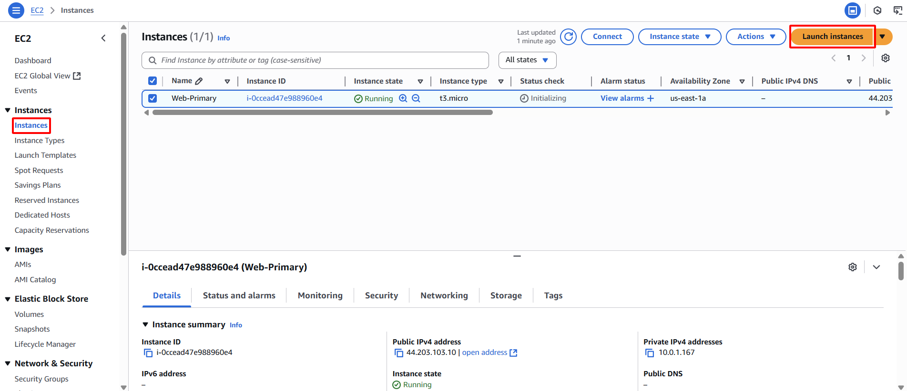

**Mục tiêu:** Triển khai EC2 Instance sẽ đóng vai trò là dịch vụ web dự phòng, sẵn sàng cho việc failover.
#### Các bước thực hiện
1. **Truy cập EC2 Dashboard:** Điều hướng đến dịch vụ EC2.
2. **Bắt đầu khởi chạy Instance:** Chọn **Instances**, sau đó nhấn **Launch instances**.

    

3. **Tên và thẻ (tags)**
    - **Name:** `Web-Backup`
4. **Chọn Amazon Machine Image (AMI):** Chọn cùng AMI đã dùng cho instance chính.

    

5. **Chọn Instance Type:** Chọn `t2.micro` hoặc `t3.micro`.
6. **Chọn Key Pair:** Chọn cùng key pair đã dùng cho instance chính.

    

7. **Cấu hình chi tiết Instance:**
    - **Network:** Chọn `sdn-project-vpc`.
    - **Subnet:** Chọn `sdn-public-subnet-1b` (triển khai trong một AZ khác để tăng cường tính sẵn sàng).
    - **Auto-assign Public IP:** Đảm bảo `Enable` được chọn.
8. **Cấu hình Security Group:**
    - Chọn một Security Group hiện có.
    - Chọn `web-server-sg`.

    

9. **Cấu hình User Data**
    - Mở rộng **Advanced Details** và tìm mục **User data**.

    

    - Dán script sau:

        ```bash
        #!/bin/bash
        sudo dnf update -y
        sudo dnf install nginx -y
        sudo systemctl start nginx
        sudo systemctl enable nginx
        echo "<h1>Hello from Web-Backup!</h1>" | sudo tee /usr/share/nginx/html/index.html
        ```

    

10. **Khởi chạy Instance:** Nhấn **Launch instance**.

    

11. **Xác nhận và ghi lại:** Ghi lại **Instance ID** của `Web-Backup` instance sau khi khởi chạy thành công.

    

    