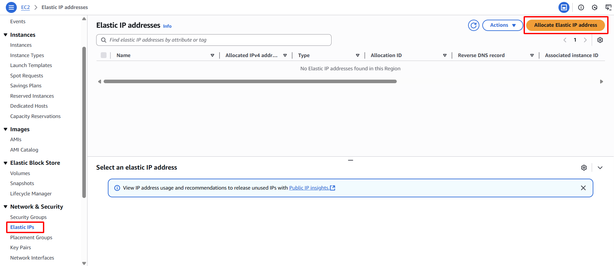

**Mục tiêu:** Cấp phát một địa chỉ IP công cộng tĩnh (Elastic IP) sẽ đóng vai trò là điểm truy cập ổn định cho các yêu cầu của client, và ban đầu liên kết nó với máy chủ web chính.
#### Các bước thực hiện
1. **Truy cập Elastic IPs:** Trong EC2 Dashboard, chọn **Elastic IPs** từ bảng điều hướng bên trái, dưới mục "Network & Security".
2. **Cấp phát địa chỉ Elastic IP:** Nhấn nút **Allocate Elastic IP address**.
    
    
    
3. **Xác nhận cấp phát:** Nhấn **Allocate**. Ghi lại **Allocation ID** của EIP vừa được cấp phát.
    
    
    
    
    
4. **Liên kết Elastic IP với instance chính:**
    - Chọn EIP vừa được cấp phát.
    - Chọn **Actions** -> **Associate Elastic IP address**.
    
    
    
    - **Resource type:** Chọn `Instance`.
    - **Instance:** Chọn `Web-Primary` (sử dụng Instance ID của nó).
    - **Reassociation:** Chọn **Allow this Elastic IP address to be reassociated**.
    - Nhấn **Associate**.
    
    
    
5. **Xác nhận và ghi lại:** Elastic IP hiện đã được liên kết với máy chủ web chính của bạn. Ghi lại **địa chỉ Elastic IP** đó. Địa chỉ IP này sẽ được sử dụng để kiểm tra dịch vụ web.
    
    