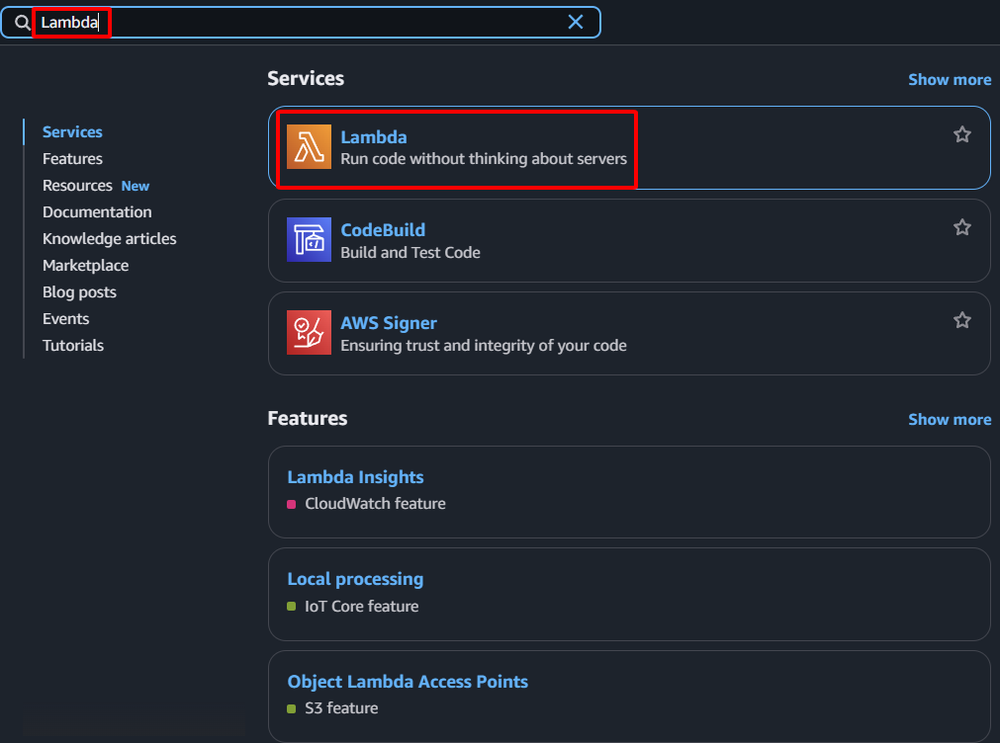

**Objective:** To create the AWS Lambda function that will execute the SDN logic, specifically managing the EIP failover.
#### Execution Steps
1. **Access AWS Management Console:** Log in to your AWS account.
2. **Navigate to the Lambda service:** In the search bar, type "Lambda" and select the Lambda service.
    
    
    
3. **Initiate function creation:**
    - Select **Functions** from the left navigation pane.
    - Click the **Create function** button.
    
    
    
4. **Configure basic function settings:**
    - **Author from scratch:** Select this option.
    - **Function name:**  `SDNEIPFailoverFunction`
    - **Runtime:** Select `Python 3.9`
    - **Architecture:** Select `x86_64`
    
    
    
    - **Permissions:** Under "Change default execution role", select **Use an existing role**. Choose the `SDNLambdaRole` previously created from the dropdown list.
    
    
    
5. **Complete function creation:** Click the **Create function** button.