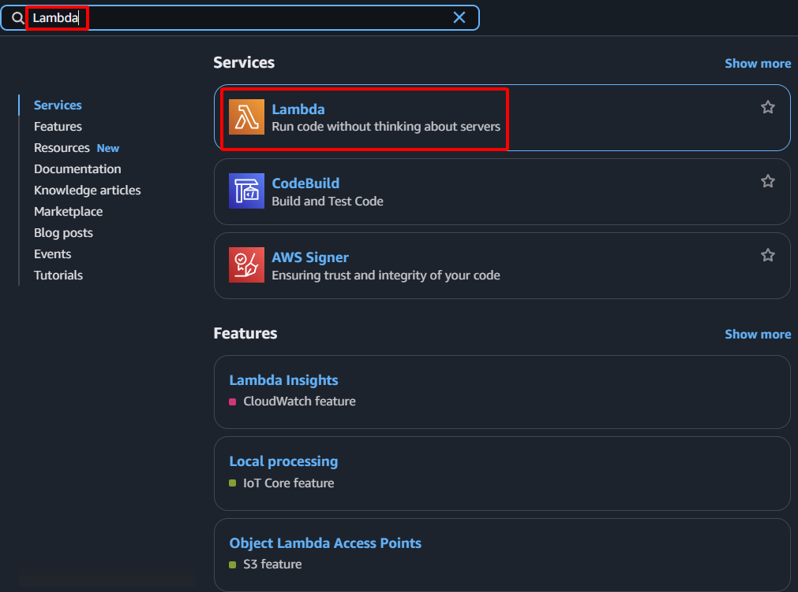

**Mục tiêu:** Tạo hàm AWS Lambda sẽ thực thi logic SDN, cụ thể là quản lý việc failover EIP.
#### Các bước thực hiện
1. **Truy cập AWS Management Console:** Đăng nhập vào tài khoản AWS của bạn.
2. **Điều hướng đến dịch vụ Lambda:** Trong thanh tìm kiếm, gõ "Lambda" và chọn dịch vụ Lambda.
    
    
    
3. **Bắt đầu tạo hàm:**
    - Chọn **Functions** từ bảng điều hướng bên trái.
    - Nhấn nút **Create function**.
    
    
    
4. **Cấu hình các cài đặt cơ bản cho hàm:**
    - **Author from scratch:** Chọn tùy chọn này.
    - **Function name:** `SDNEIPFailoverFunction`
    - **Runtime:** Chọn `Python 3.9`
    - **Architecture:** Chọn `x86_64`.
    
    
    
    - **Permissions:** Dưới "Change default execution role", chọn **Use an existing role**. Chọn `SDNLambdaRole` đã tạo trước đó từ danh sách thả xuống.
    
    
    
5. **Hoàn tất việc tạo hàm:** Nhấn nút **Create function**.