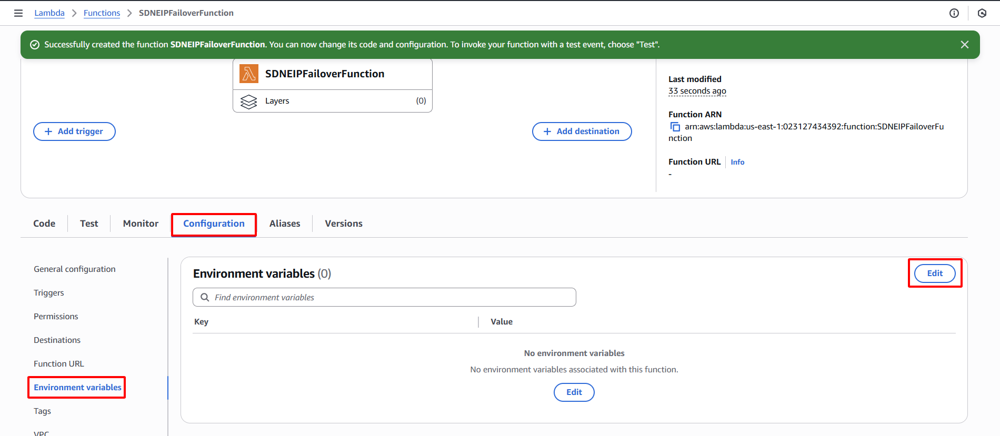

**Objective:** To provide the Lambda function with essential information, including the Elastic IP Allocation ID and the Instance IDs of both the primary and backup web servers, enabling it to perform its failover operations.
#### Execution Steps
1. **Access Lambda function configuration:** After the `SDNEIPFailoverFunction` is created, select the **Configuration** tab.
2. **Edit environment variables:**
    - Select **Environment variables** from the left-hand menu.
    - Click the **Edit** button.
    
    
    
3. **Add required variables:**
    - Click **Add environment variable**.
        - **Key:** `EIP_ALLOCATION_ID`
        - **Value:** Enter the **Allocation ID** of the Elastic IP recorded in Section 3.3.
    - Click **Add environment variable**.
        - **Key:** `WEB_BACKUP_INSTANCE_ID`
        - **Value:** Enter the **Instance ID** of the `Web-Backup` EC2 instance recorded in Section 3.2.
    - Click **Add environment variable**.
        - **Key:** `WEB_PRIMARY_INSTANCE_ID`
        - **Value:** Enter the **Instance ID** of the `Web-Primary` EC2 instance recorded in Section 3.1.
4. **Save changes:** Click the **Save** button.
    
    