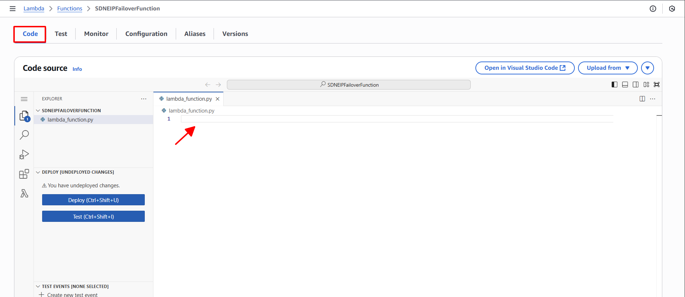

**Objective:** To provide the executable Python code to the Lambda function, which defines the logic for detecting primary server failure and orchestrating the Elastic IP reassignment to the backup server.
#### Execution Steps
1. **Access Lambda function code editor:** In the configuration of your `SDNEIPFailoverFunction`, select the **Code** tab.
2. **Replace default code:** Remove any default code present in the `lambda_function.py` editor window.
    
    
    
3. **Paste provided code:** Insert the following Python code into the `lambda_function.py` editor:
    
    ```python
    import boto3
    import os
    import json # Import json library to parse JSON strings
    
    # Initialize the EC2 client
    ec2_client = boto3.client('ec2')
    
    # Retrieve Environment Variables for EIP and Instance IDs
    EIP_ALLOCATION_ID = os.environ.get('EIP_ALLOCATION_ID')
    WEB_BACKUP_INSTANCE_ID = os.environ.get('WEB_BACKUP_INSTANCE_ID')
    WEB_PRIMARY_INSTANCE_ID = os.environ.get('WEB_PRIMARY_INSTANCE_ID')
    
    def lambda_handler(event, context):
        print("--- Full Event Received ---")
        print(event) # Print the entire event object to logs for debugging its structure
        print("-------------------------")
    
        instance_id_in_alarm = None
        state_value = None
    
        # Safely extract the alarm state value
        if 'detail' in event and 'state' in event['detail'] and 'value' in event['detail']['state']:
            state_value = event['detail']['state']['value']
    
        # --- Start of robust InstanceId extraction ---
        # Try to find InstanceId from 'configuration.metrics' directly
        try:
            if 'detail' in event and 'configuration' in event['detail'] and 'metrics' in event['detail']['configuration']:
                for metric_config in event['detail']['configuration']['metrics']:
                    if 'metricStat' in metric_config and 'metric' in metric_config['metricStat'] and 'dimensions' in metric_config['metricStat']['metric']:
                        dimensions_dict = metric_config['metricStat']['metric']['dimensions']
                        if isinstance(dimensions_dict, dict) and 'InstanceId' in dimensions_dict:
                            instance_id_in_alarm = dimensions_dict['InstanceId']
                            break # Found, exit this loop
                
        except Exception as e:
            print(f"Error parsing Instance ID from configuration.metrics: {e}")
    
        # Fallback: If InstanceId not found, try parsing 'reasonData'.
        if not instance_id_in_alarm and 'detail' in event and 'state' in event['detail'] and 'reasonData' in event['detail']['state']:
            try:
                reason_data_str = event['detail']['state']['reasonData']
                reason_data_json = json.loads(reason_data_str)
                
                if 'metrics' in reason_data_json and len(reason_data_json['metrics']) > 0:
                    first_metric = reason_data_json['metrics'][0]
                    if 'metricStat' in first_metric and 'metric' in first_metric['metricStat'] and 'dimensions' in first_metric['metricStat']['metric']:
                        dimensions_dict_reason = first_metric['metricStat']['metric']['dimensions']
                        if isinstance(dimensions_dict_reason, dict) and 'InstanceId' in dimensions_dict_reason:
                            instance_id_in_alarm = dimensions_dict_reason['InstanceId']
            except Exception as e:
                print(f"Error parsing Instance ID from reasonData: {e}")
        
        # --- End of robust InstanceId extraction ---
    
        # If InstanceId was still not found after all attempts, log and exit
        if not instance_id_in_alarm:
            print("Could not find 'InstanceId' in alarm details after all parsing attempts. Exiting.")
            return {
                'statusCode': 400,
                'body': 'InstanceId not found in alarm event.'
            }
    
        # Check if the alarm is for the primary web server and is in ALARM state
        if instance_id_in_alarm == WEB_PRIMARY_INSTANCE_ID and state_value == 'ALARM':
            print(f"Web-Primary ({WEB_PRIMARY_INSTANCE_ID}) is in ALARM state. Initiating failover.")
            try:
                # Describe the EIP to check its current association
                response = ec2_client.describe_addresses(
                    AllocationIds=[EIP_ALLOCATION_ID]
                )
                current_association_id = None
                current_associated_instance_id = None
    
                if response['Addresses'] and 'AssociationId' in response['Addresses'][0]:
                    current_association_id = response['Addresses'][0]['AssociationId']
                    print(f"Current EIP association ID: {current_association_id}")
                    if 'InstanceId' in response['Addresses'][0]:
                        current_associated_instance_id = response['Addresses'][0]['InstanceId']
                        print(f"EIP is currently associated with instance: {current_associated_instance_id}")
    
                # If EIP is associated with Web-Primary, disassociate it
                if current_associated_instance_id == WEB_PRIMARY_INSTANCE_ID:
                    print(f"EIP is currently associated with Web-Primary. Disassociating...")
                    ec2_client.disassociate_address(AssociationId=current_association_id)
                    print("Disassociated EIP.")
                else:
                    print(f"EIP is not currently associated with Web-Primary ({WEB_PRIMARY_INSTANCE_ID}) or not associated. Current: {current_associated_instance_id}. Proceeding to associate with backup.")
    
                # Associate the EIP with Web-Backup
                ec2_client.associate_address(
                    InstanceId=WEB_BACKUP_INSTANCE_ID,
                    AllocationId=EIP_ALLOCATION_ID
                )
                print(f"EIP {EIP_ALLOCATION_ID} successfully associated with Web-Backup ({WEB_BACKUP_INSTANCE_ID}).")
                return {
                    'statusCode': 200,
                    'body': 'Failover completed successfully.'
                }
    
            except Exception as e:
                print(f"Error during failover: {e}")
                return {
                    'statusCode': 500,
                    'body': f'Failover failed: {e}'
                }
        else:
            # Log if the alarm is not for the primary instance or not in ALARM state
            print(f"Alarm not for Web-Primary ({WEB_PRIMARY_INSTANCE_ID}) or not in ALARM state ({state_value}). No action taken.")
            print(f"Instance ID from alarm: {instance_id_in_alarm}")
    
        return {
            'statusCode': 200,
            'body': 'No relevant action performed.'
        }
    ```
    
4. **Deploy code:** Click the **Deploy** button to save and deploy the changes to your Lambda function.
    
    