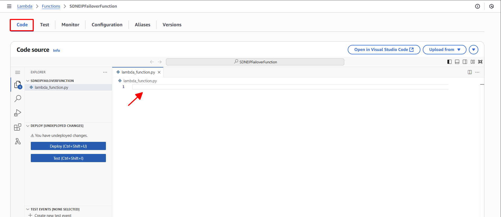

**Mục tiêu:** Cung cấp code Python có thể thực thi cho hàm Lambda, định nghĩa logic để phát hiện lỗi máy chủ chính và điều phối việc gán lại Elastic IP cho máy chủ dự phòng.
#### Các bước thực hiện
1. **Truy cập trình soạn thảo code của hàm Lambda:** Trong cấu hình của `SDNEIPFailoverFunction`, chọn tab **Code**.
2. **Thay thế code mặc định:** Xóa bất kỳ code mặc định nào có sẵn trong cửa sổ soạn thảo `lambda_function.py`.

    

3. **Dán code được cung cấp:** Chèn code Python sau vào trình soạn thảo `lambda_function.py`:

    ```python
    import boto3
    import os
    import json # Import json library to parse JSON strings

    # Initialize the EC2 client
    ec2_client = boto3.client('ec2')

    # Retrieve Environment Variables for EIP and Instance IDs
    EIP_ALLOCATION_ID = os.environ.get('EIP_ALLOCATION_ID')
    WEB_BACKUP_INSTANCE_ID = os.environ.get('WEB_BACKUP_INSTANCE_ID')
    WEB_PRIMARY_INSTANCE_ID = os.environ.get('WEB_PRIMARY_INSTANCE_ID')

    def lambda_handler(event, context):
        print("--- Full Event Received ---")
        print(event) # Print the entire event object to logs for debugging its structure
        print("-------------------------")

        instance_id_in_alarm = None
        state_value = None

        # Safely extract the alarm state value
        if 'detail' in event and 'state' in event['detail'] and 'value' in event['detail']['state']:
            state_value = event['detail']['state']['value']

        # --- Start of robust InstanceId extraction ---
        # Try to find InstanceId from 'configuration.metrics' directly
        try:
            if 'detail' in event and 'configuration' in event['detail'] and 'metrics' in event['detail']['configuration']:
                for metric_config in event['detail']['configuration']['metrics']:
                    if 'metricStat' in metric_config and 'metric' in metric_config['metricStat'] and 'dimensions' in metric_config['metricStat']['metric']:
                        dimensions_dict = metric_config['metricStat']['metric']['dimensions']
                        if isinstance(dimensions_dict, dict) and 'InstanceId' in dimensions_dict:
                            instance_id_in_alarm = dimensions_dict['InstanceId']
                            break # Found, exit this loop
                
        except Exception as e:
            print(f"Error parsing Instance ID from configuration.metrics: {e}")

        # Fallback: If InstanceId not found, try parsing 'reasonData'.
        if not instance_id_in_alarm and 'detail' in event and 'state' in event['detail'] and 'reasonData' in event['detail']['state']:
            try:
                reason_data_str = event['detail']['state']['reasonData']
                reason_data_json = json.loads(reason_data_str) # Parse the JSON string
                
                if 'metrics' in reason_data_json and len(reason_data_json['metrics']) > 0:
                    first_metric = reason_data_json['metrics'][0]
                    if 'metricStat' in first_metric and 'metric' in first_metric['metricStat'] and 'dimensions' in first_metric['metricStat']['metric']:
                        dimensions_dict_reason = first_metric['metricStat']['metric']['dimensions']
                        if isinstance(dimensions_dict_reason, dict) and 'InstanceId' in dimensions_dict_reason:
                            instance_id_in_alarm = dimensions_dict_reason['InstanceId']
            except Exception as e:
                print(f"Error parsing Instance ID from reasonData: {e}")
        
        # --- End of robust InstanceId extraction ---

        # If InstanceId was still not found after all attempts, log and exit
        if not instance_id_in_alarm:
            print("Could not find 'InstanceId' in alarm details after all parsing attempts. Exiting.")
            return {
                'statusCode': 400,
                'body': 'InstanceId not found in alarm event.'
            }

        # Check if the alarm is for the primary web server and is in ALARM state
        if instance_id_in_alarm == WEB_PRIMARY_INSTANCE_ID and state_value == 'ALARM':
            print(f"Web-Primary ({WEB_PRIMARY_INSTANCE_ID}) is in ALARM state. Initiating failover.")
            try:
                # Describe the EIP to check its current association
                response = ec2_client.describe_addresses(
                    AllocationIds=[EIP_ALLOCATION_ID]
                )
                current_association_id = None
                current_associated_instance_id = None

                if response['Addresses'] and 'AssociationId' in response['Addresses'][0]:
                    current_association_id = response['Addresses'][0]['AssociationId']
                    print(f"Current EIP association ID: {current_association_id}")
                    if 'InstanceId' in response['Addresses'][0]:
                        current_associated_instance_id = response['Addresses'][0]['InstanceId']
                        print(f"EIP is currently associated with instance: {current_associated_instance_id}")

                # If EIP is associated with Web-Primary, disassociate it
                if current_associated_instance_id == WEB_PRIMARY_INSTANCE_ID:
                    print(f"EIP is currently associated with Web-Primary. Disassociating...")
                    ec2_client.disassociate_address(AssociationId=current_association_id)
                    print("Disassociated EIP.")
                else:
                    print(f"EIP is not currently associated with Web-Primary ({WEB_PRIMARY_INSTANCE_ID}) or not associated. Current: {current_associated_instance_id}. Proceeding to associate with backup.")

                # Associate the EIP with Web-Backup
                ec2_client.associate_address(
                    InstanceId=WEB_BACKUP_INSTANCE_ID,
                    AllocationId=EIP_ALLOCATION_ID
                )
                print(f"EIP {EIP_ALLOCATION_ID} successfully associated with Web-Backup ({WEB_BACKUP_INSTANCE_ID}).")
                return {
                    'statusCode': 200,
                    'body': 'Failover completed successfully.'
                }

            except Exception as e:
                print(f"Error during failover: {e}")
                return {
                    'statusCode': 500,
                    'body': f'Failover failed: {e}'
                }
        else:
            # Log if the alarm is not for the primary instance or not in ALARM state
            print(f"Alarm not for Web-Primary ({WEB_PRIMARY_INSTANCE_ID}) or not in ALARM state ({state_value}). No action taken.")
            print(f"Instance ID from alarm: {instance_id_in_alarm}")

        return {
            'statusCode': 200,
            'body': 'No relevant action performed.'
        }
    ```
    
4. **Deploy code:** Nhấn nút **Deploy** để lưu và triển khai các thay đổi cho hàm Lambda của bạn.

    