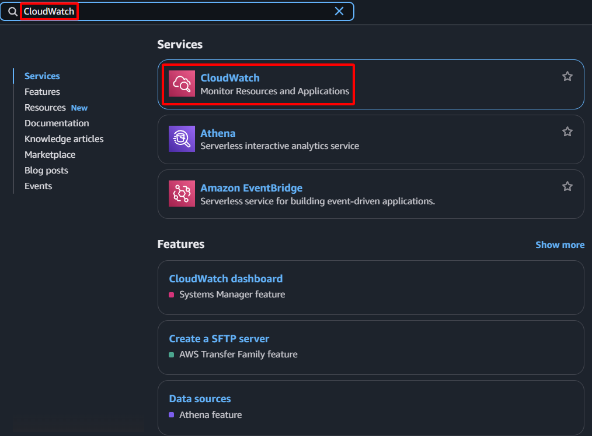

**Mục tiêu:** Thiết lập một alarm để giám sát trạng thái kiểm tra sức khỏe hệ thống của EC2 instance `Web-Primary` và kích hoạt cảnh báo nếu phát hiện lỗi.
#### Các bước thực hiện
1. **Truy cập AWS Management Console:** Đăng nhập vào tài khoản AWS của bạn.
2. **Điều hướng đến dịch vụ CloudWatch:** Trong thanh tìm kiếm, gõ "CloudWatch" và chọn dịch vụ CloudWatch.
    
    
    
3. **Bắt đầu tạo alarm:**
    - Chọn **All alarms** từ bảng điều hướng bên trái.
    - Nhấn nút **Create alarm**.
    
    
    
4. **Chọn metric:**
    - Nhấn **Select metric**.
    
    
    
    - Chọn **EC2 Metrics** -> **Per-Instance Metrics**.
    
    
    
    
    
    - Định vị và chọn metric `StatusCheckFailed_System` cho instance `Web-Primary` của bạn.
    
    
    
5. **Cấu hình metric và điều kiện:**
    - **Metric đã chọn:** `StatusCheckFailed_System` (đặt Statistic là `Average`, Period là `30 seconds`).
    
    
    
    - **Conditions:**
        - **Threshold type:** Chọn `Static`.
        - **Whenever StatusCheckFailed_System is:** Chọn `Greater/Equal`.
        - **than:** Nhập `1`.
    - **Additional configuration:**
        - **Missing data treatment:** Chọn **Treat missing data as bad**.
    
    
    
6. **Cấu hình actions:**
    - Nhấn **Next**.
    - **Alarm state trigger:** Đảm bảo `In ALARM` được chọn.
    - **Select an SNS topic:**
        - Chọn **Create new topic**.
        - **Topic name:** Nhập `SDN_Failover_Notifications`.
        - Thêm địa chỉ email của bạn để nhận thông báo trực tiếp.
        - Nhấn **Create topic**.
        
    
    
7. **Cấu hình tên và mô tả:**
    - Nhấn **Next**.
    
    
    
    - **Alarm name:** Nhập `Web-Primary-System-Check-Failed`.
    - **Alarm description:** `Triggers when Web-Primary instance fails system checks.`
    - Nhấn **Next**.
    
    
    
8. **Hoàn tất việc tạo alarm:** Nhấn nút **Create alarm**.
    
    
    
    
    
9. Kiểm tra email của bạn và xác nhận đăng ký.
    
    