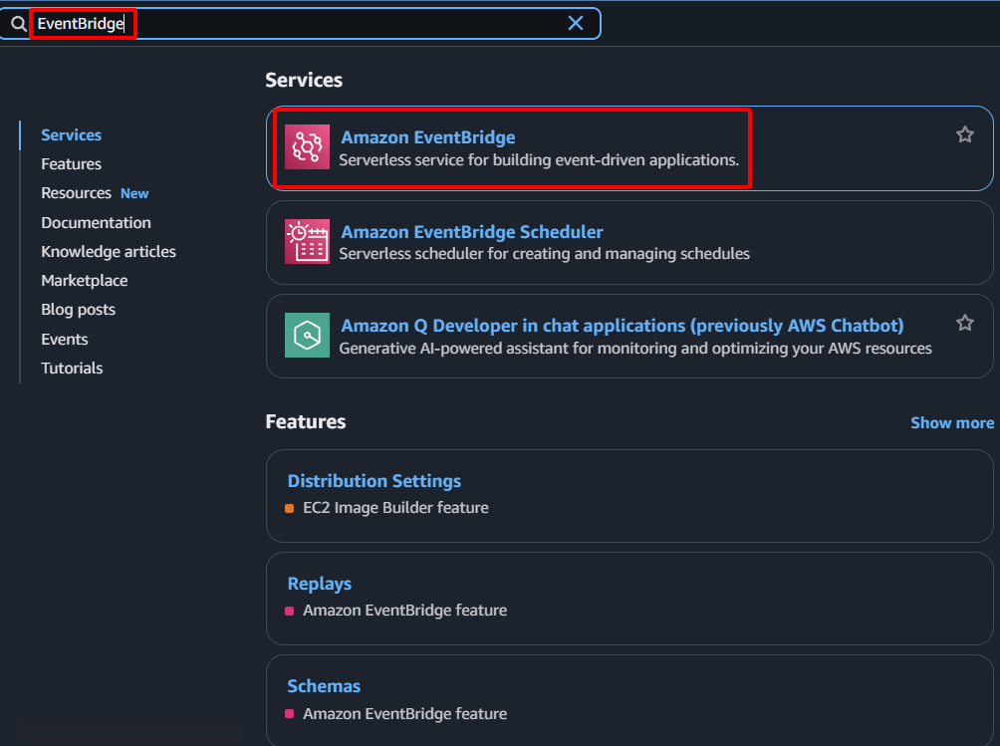

**Objective:** To link the `Web-Primary-System-Check-Failed` CloudWatch Alarm to the `SDNEIPFailoverFunction` Lambda function, ensuring the failover logic is automatically executed upon alarm activation.
#### Execution Steps
1. **Access AWS Management Console:** Log in to your AWS account.
2. **Navigate to the EventBridge service:** In the search bar, type "EventBridge" and select the EventBridge service.
    
    
    
3. **Initiate rule creation:**
    - Select **Rules** from the left navigation pane.
    - Click the **Create rule** button.
    
    
    
4. **Configure rule details:**
    - **Name:**  `SDN-Failover-Rule`
    - **Description:**  `Triggers Lambda function on Web-Primary alarm.`
    - **Event bus:** Select `default`.
    - **Rule type:** Choose `Rule with an event pattern`.
    - Click **Next**.
    
    
    
5. **Configure event pattern:**
    - **Creation method:** Select **Custom pattern (JSON editor)**
    - **Edit the Event pattern JSON:** In the "Event pattern" text area, insert JSON text below:
        
        ```json
        {
          "source": ["aws.cloudwatch"],
          "detail-type": ["CloudWatch Alarm State Change"],
          "detail": {
            "alarmName": ["Web-Primary-System-Check-Failed"],
            "state": {
              "value": ["ALARM"]
            }
          }
        }
        ```
        
    - Click **Next**.
    
    
    
6. **Configure target:**
    - **Target types:** Select `AWS service`
    - **Select a target:** Choose `Lambda function`
    - **Function:** Select `SDNEIPFailoverFunction` (your Lambda function).
    - Click **Next**.
    
    
    
    
    
7. **Review and create:**
    - Review the rule configuration.
    - Click **Create rule**.
    
    
    
8. **Confirm:** The new `SDN-Failover-Rule` will appear in the EventBridge Rules list, indicating it is now configured to trigger your Lambda function based on the CloudWatch alarm.
    
    