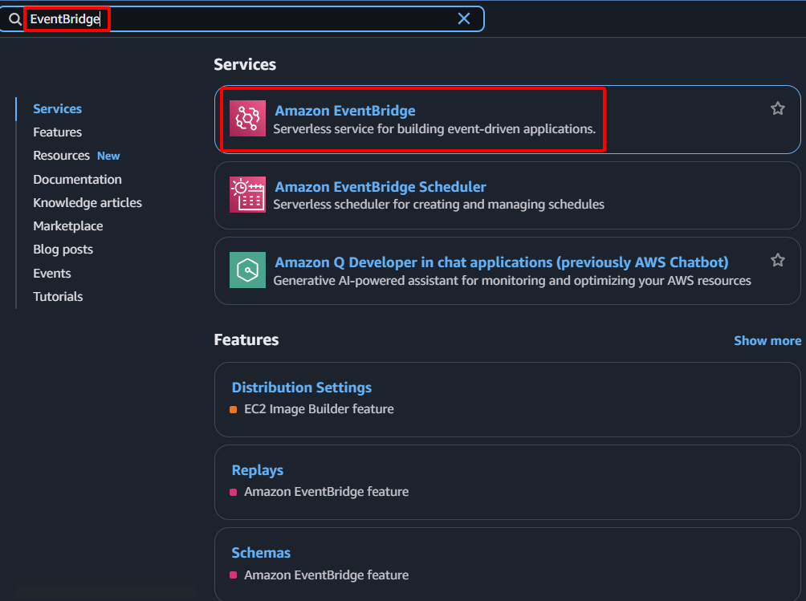

**Mục tiêu:** Liên kết CloudWatch Alarm `Web-Primary-System-Check-Failed` với hàm Lambda `SDNEIPFailoverFunction`, đảm bảo logic failover được tự động thực thi khi alarm được kích hoạt.
#### Các bước thực hiện
1. **Truy cập AWS Management Console:** Đăng nhập vào tài khoản AWS của bạn.
2. **Điều hướng đến dịch vụ EventBridge:** Trong thanh tìm kiếm, gõ "EventBridge" và chọn dịch vụ EventBridge.
    
    
    
3. **Bắt đầu tạo rule:**
    - Chọn **Rules** từ bảng điều hướng bên trái.
    - Nhấn nút **Create rule**.
    
    
    
4. **Cấu hình chi tiết rule:**
    - **Name:** `SDN-Failover-Rule`
    - **Description:** `Kích hoạt hàm Lambda khi alarm của Web-Primary.`
    - **Event bus:** Chọn `default`.
    - **Rule type:** Chọn `Rule with an event pattern`.
    - Nhấn **Next**.
    
    
    
5. **Cấu hình mẫu sự kiện:**
    - **Creation method:** Chọn **Custom pattern (JSON editor)**.
    - **Chỉnh sửa JSON mẫu sự kiện:** Trong vùng văn bản "Event pattern", chèn đoạn JSON sau:
        
        ```json
        {
          "source": ["aws.cloudwatch"],
          "detail-type": ["CloudWatch Alarm State Change"],
          "detail": {
            "alarmName": ["Web-Primary-System-Check-Failed"],
            "state": {
              "value": ["ALARM"]
            }
          }
        }
        ```
        
    - Nhấn **Next**.
    
    
    
6. **Cấu hình target:**
    - **Target types:** Chọn `AWS service`.
    - **Select a target:** Chọn `Lambda function`.
    - **Function:** Chọn `SDNEIPFailoverFunction` (hàm Lambda của bạn).
    - Nhấn **Next**.
    
    
    
    
    
7. **Xem lại và tạo:**
    - Xem lại cấu hình rule.
    - Nhấn **Create rule**.
    
    
    
8. **Xác nhận:** Rule `SDN-Failover-Rule` mới sẽ xuất hiện trong danh sách EventBridge Rules, cho thấy nó đã được cấu hình để kích hoạt hàm Lambda dựa trên CloudWatch alarm.
    
    