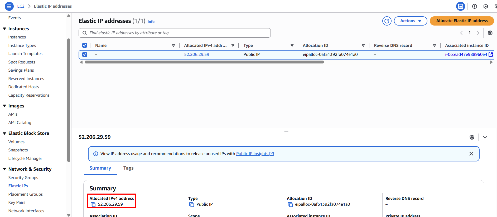

**Mục tiêu:** Xác minh rằng dịch vụ web có thể truy cập ban đầu qua Elastic IP và đang phục vụ đúng nội dung từ máy chủ web chính.
#### Các bước thực hiện
1. **Truy xuất địa chỉ Elastic IP:** Lấy địa chỉ Elastic IP đã ghi lại trong Phần 3.3.

    

2. **Truy cập dịch vụ Web:** Mở một trình duyệt web.
3. **Điều hướng đến EIP:** Nhập địa chỉ Elastic IP kèm cổng 80 vào thanh địa chỉ của trình duyệt và nhấn Enter.

    

4. **Xác nhận phản hồi từ máy chủ chính:** Trình duyệt sẽ hiển thị nội dung "Hello from Web-Primary!", xác nhận máy chủ chính đang hoạt động và có thể truy cập qua EIP.

    