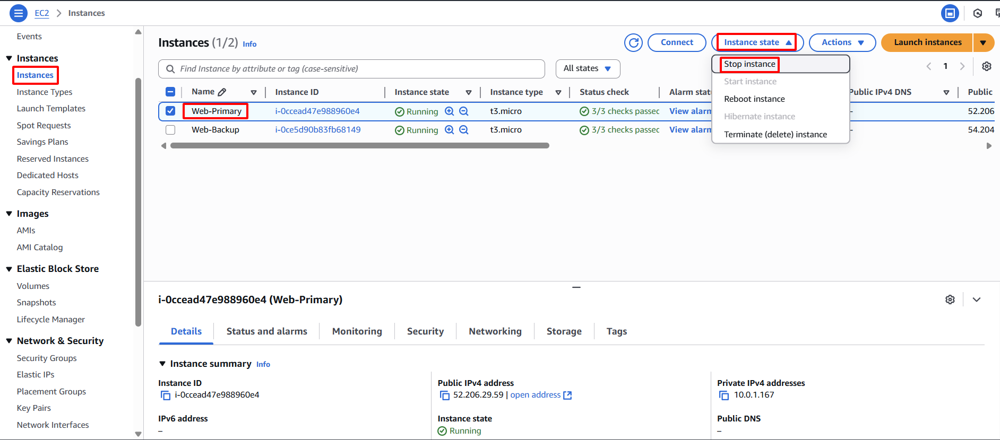

**Mục tiêu:** Cố ý gây ra lỗi trên EC2 instance `Web-Primary`, từ đó kích hoạt CloudWatch Alarm và sau đó là quá trình failover được điều khiển bởi SDN.
#### Các bước thực hiện
1. **Truy cập EC2 Dashboard:** Điều hướng đến dịch vụ EC2 trong AWS Management Console.
2. **Chọn Instance chính:** Từ danh sách "Instances", chọn EC2 instance `Web-Primary` của bạn.
3. **Dừng Instance:**
    - Chọn **Instance state**.
    - Chọn **Stop instance**.
    - Xác nhận hành động khi được hỏi.
    
    
    
    
    
4. **Giám sát trạng thái Alarm:** Chờ vài phút để CloudWatch phát hiện sự thay đổi trạng thái của instance. Giám sát alarm `Web-Primary-System-Check-Failed` trong bảng điều khiển CloudWatch Alarms. Trạng thái của alarm được mong đợi sẽ chuyển từ `OK` sang `INSUFFICIENT_DATA` và sau đó sang `ALARM`.
    
    