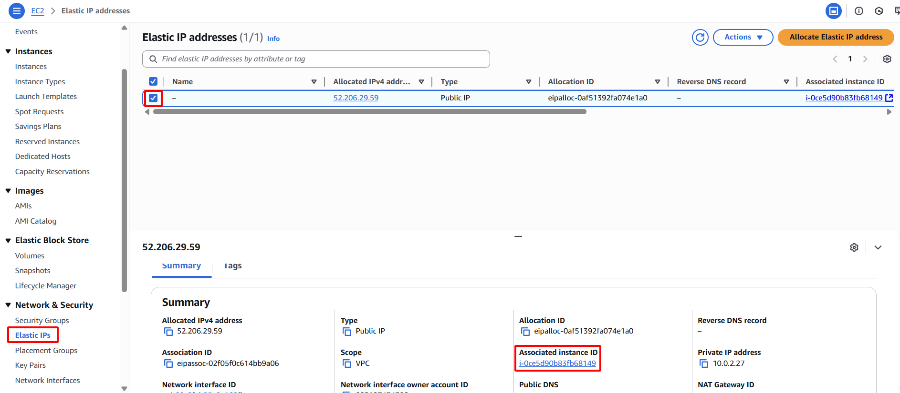

**Objective:** To confirm that the Elastic IP has been successfully disassociated from the failed primary server and reassociated with the backup server, indicating successful dynamic routing and policy automation.
#### Execution Steps
1. **Verify Elastic IP Association:**
    - Navigate back to the EC2 service.
    - Select **Elastic IPs** from the left navigation pane.
    - Examine the details of your Elastic IP. Confirm that its association has changed and it is now linked to the `Web-Backup` EC2 instance.
    
    
    
2. **Access Web Service via EIP (Second Attempt)**
    - Reload your web browser
    - **Confirm Backup Server Response:** The browser should now display content indicating "Hello from Web-Backup!". This conclusively demonstrates that the traffic has been dynamically rerouted to the healthy backup server by the SDN control plane.
    
    