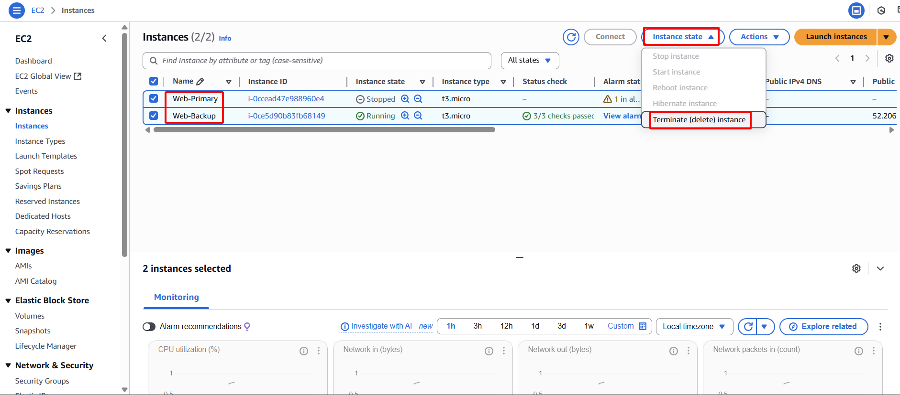

This final section provides a comprehensive guide for systematically removing all AWS resources deployed during this lab. Adhering to these steps is critical to avoid incurring unnecessary ongoing charges in your AWS account.

#### Terminate EC2 Instances

- **Objective:** To terminate both the primary and backup EC2 instances, ensuring they no longer consume compute resources.
- **Execution Steps:**
    1. **Access EC2 Dashboard:** Navigate to the EC2 service in the AWS Management Console.
    2. **Select Instances:** From the "Instances" list, select both your `Web-Primary` and `Web-Backup` EC2 instances.
    3. **Terminate Instances:**
        - Choose **Instance state**.
        - Select **Terminate instance**.
        - Confirm the action when prompted.
        
        
        
        
        

#### Release Elastic IP

- **Objective:** To disassociate (if still associated) and release the Elastic IP address, making it available for other AWS accounts and ceasing any potential charges.
- **Execution Steps:**
    1. **Access Elastic IPs:** In the EC2 Dashboard, select **Elastic IPs** from the left navigation pane.
    2. **Disassociate EIP (if needed):** If the EIP is still associated with any instance, select the EIP, choose **Actions**, and then **Disassociate Elastic IP address**. Confirm the action.
        
        
        
        
        
    3. **Release EIP:** Select the EIP. Choose **Actions**, and then **Release Elastic IP address**. Confirm the action.
    
    
    
    
    

#### Delete Lambda Function

- **Objective:** To delete the AWS Lambda function, which served as the SDN control plane, ensuring its code and configuration are removed.
- **Execution Steps:**
    1. **Access Lambda Service:** Navigate to the Lambda service in the AWS Management Console.
    2. **Select Lambda Function:** Select your `SDNEIPFailoverFunction`.
    3. **Delete Function:** Choose **Actions**, and then **Delete function**. Confirm the deletion.
    
    
    
    
    

#### Delete CloudWatch Alarm

- **Objective:** To remove the CloudWatch alarm configured to monitor the primary web server's health.
- **Execution Steps:**
    1. **Access CloudWatch Service:** Navigate to the CloudWatch service.
    2. **Select Alarms:** Select **Alarms** from the left navigation pane.
    3. **Delete Alarm:** Select the `Web-Primary-System-Check-Failed` alarm. Choose **Actions**, and then **Delete**. Confirm the deletion.
    
    
    
    
    

#### Delete EventBridge Rule

- **Objective:** To remove the EventBridge rule that linked the CloudWatch alarm to the Lambda function.
- **Execution Steps:**
    1. **Access EventBridge Service:** Navigate to the EventBridge service.
    2. **Select Rules:** Select **Rules** from the left navigation pane.
    3. **Delete Rule:** Select your `SDN-Failover-Rule`. Choose **Actions**, and then **Delete**. Confirm the deletion.
    
    
    
    
    

#### Delete IAM Role and Policy

- **Objective:** To remove the IAM role and policy that granted permissions to the Lambda function, ensuring all associated access rights are revoked.
- **Execution Steps:**
    1. **Access IAM Service:** Navigate to the IAM service.
    2. **Delete IAM Role:**
        - Select **Roles** from the left navigation pane.
        - Select `SDNLambdaRole`. Choose **Delete role**. Confirm the deletion.
        
        
        
        
        
    3. **Delete IAM Policy:**
        - Select **Policies** from the left navigation pane.
        - Select `SDNLambdaEIPControlPolicy`. Choose **Actions**, and then **Delete**. Confirm the deletion.
        
        
        
        
        

#### Delete VPC

- **Objective:** To delete the Virtual Private Cloud, which is the foundational network environment for this lab. This is the final step in resource cleanup.
- **Execution Steps:**
    1. **Access Your VPCs:** Navigate to the VPC service, then select **Your VPCs**.
    2. **Delete VPC:** Select `sdn-project-vpc`. Choose **Actions**, and then **Delete VPC**. Confirm the deletion. *Note: Ensure all associated resources (instances, EIPs, IGWs, subnets, etc.) are deleted or detached before attempting to delete the VPC. AWS will generally prevent VPC deletion if active resources remain within it.*
    
    
    
    